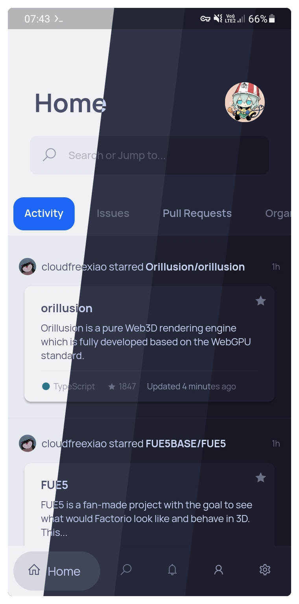

<h3 align="center">
	 
	
	Catppuccin for <a href="https://github.com/NamanShergill/diohub">DioHub</a>
	
</h3>

	
	
	

	

## Previews

🌻 Latte

🪴 Frappé

🌺 Macchiato

🌿 Mocha

## Usage

1. Ensure [DioHub](https://github.com/NamanShergill/diohub) is installed.
2. Open the link below:

🌻 Latte

- **<a href="https://theme.felix.diohub?format_ver=0&elementsOnColours=ff5c5f77&accent=ffdc8a78&faded3=ff9ca0b0&faded2=ff8c8fa1&faded1=ff7c7f93&baseElements=ff4c4f69&secondary=ffe6e9ef&primary=ffeff1f5">&nbsp;Rosewater</a>**
- **<a href="https://theme.felix.diohub?format_ver=0&elementsOnColours=ff5c5f77&accent=ffdd7878&faded3=ff9ca0b0&faded2=ff8c8fa1&faded1=ff7c7f93&baseElements=ff4c4f69&secondary=ffe6e9ef&primary=ffeff1f5">&nbsp;Flamingo</a>**
- **<a href="https://theme.felix.diohub?format_ver=0&elementsOnColours=ff5c5f77&accent=ffea76cb&faded3=ff9ca0b0&faded2=ff8c8fa1&faded1=ff7c7f93&baseElements=ff4c4f69&secondary=ffe6e9ef&primary=ffeff1f5">&nbsp;Pink</a>**
- **<a href="https://theme.felix.diohub?format_ver=0&elementsOnColours=ff5c5f77&accent=ff8839ef&faded3=ff9ca0b0&faded2=ff8c8fa1&faded1=ff7c7f93&baseElements=ff4c4f69&secondary=ffe6e9ef&primary=ffeff1f5">&nbsp;Mauve</a>**
- **<a href="https://theme.felix.diohub?format_ver=0&elementsOnColours=ff5c5f77&accent=ffd20f39&faded3=ff9ca0b0&faded2=ff8c8fa1&faded1=ff7c7f93&baseElements=ff4c4f69&secondary=ffe6e9ef&primary=ffeff1f5">&nbsp;Red</a>**
- **<a href="https://theme.felix.diohub?format_ver=0&elementsOnColours=ff5c5f77&accent=ffe64553&faded3=ff9ca0b0&faded2=ff8c8fa1&faded1=ff7c7f93&baseElements=ff4c4f69&secondary=ffe6e9ef&primary=ffeff1f5">&nbsp;Maroon</a>**
- **<a href="https://theme.felix.diohub?format_ver=0&elementsOnColours=ff5c5f77&accent=fffe640b&faded3=ff9ca0b0&faded2=ff8c8fa1&faded1=ff7c7f93&baseElements=ff4c4f69&secondary=ffe6e9ef&primary=ffeff1f5">&nbsp;Peach</a>**
- **<a href="https://theme.felix.diohub?format_ver=0&elementsOnColours=ff5c5f77&accent=ffdf8e1d&faded3=ff9ca0b0&faded2=ff8c8fa1&faded1=ff7c7f93&baseElements=ff4c4f69&secondary=ffe6e9ef&primary=ffeff1f5">&nbsp;Yellow</a>**
- **<a href="https://theme.felix.diohub?format_ver=0&elementsOnColours=ff5c5f77&accent=ff40a02b&faded3=ff9ca0b0&faded2=ff8c8fa1&faded1=ff7c7f93&baseElements=ff4c4f69&secondary=ffe6e9ef&primary=ffeff1f5">&nbsp;Green</a>**
- **<a href="https://theme.felix.diohub?format_ver=0&elementsOnColours=ff5c5f77&accent=ff179299&faded3=ff9ca0b0&faded2=ff8c8fa1&faded1=ff7c7f93&baseElements=ff4c4f69&secondary=ffe6e9ef&primary=ffeff1f5">&nbsp;Teal</a>**
- **<a href="https://theme.felix.diohub?format_ver=0&elementsOnColours=ff5c5f77&accent=ff04a5e5&faded3=ff9ca0b0&faded2=ff8c8fa1&faded1=ff7c7f93&baseElements=ff4c4f69&secondary=ffe6e9ef&primary=ffeff1f5">&nbsp;Sky</a>**
- **<a href="https://theme.felix.diohub?format_ver=0&elementsOnColours=ff5c5f77&accent=ff209fb5&faded3=ff9ca0b0&faded2=ff8c8fa1&faded1=ff7c7f93&baseElements=ff4c4f69&secondary=ffe6e9ef&primary=ffeff1f5">&nbsp;Sapphire</a>**
- **<a href="https://theme.felix.diohub?format_ver=0&elementsOnColours=ff5c5f77&accent=ff1e66f5&faded3=ff9ca0b0&faded2=ff8c8fa1&faded1=ff7c7f93&baseElements=ff4c4f69&secondary=ffe6e9ef&primary=ffeff1f5">&nbsp;Blue</a>**
- **<a href="https://theme.felix.diohub?format_ver=0&elementsOnColours=ff5c5f77&accent=ff7287fd&faded3=ff9ca0b0&faded2=ff8c8fa1&faded1=ff7c7f93&baseElements=ff4c4f69&secondary=ffe6e9ef&primary=ffeff1f5">&nbsp;Lavender</a>**

🪴 Frappe

- **<a href="https://theme.felix.diohub?format_ver=0&elementsOnColours=ffb5bfe2&accent=fff4dbd6&faded3=ff6c7086&faded2=ff7f849c&faded1=ff9399b2&baseElements=ffc6d0f5&secondary=ff292c3c&primary=ff303446">&nbsp;Rosewater</a>**
- **<a href="https://theme.felix.diohub?format_ver=0&elementsOnColours=ffb5bfe2&accent=fff0c6c6&faded3=ff6c7086&faded2=ff7f849c&faded1=ff9399b2&baseElements=ffc6d0f5&secondary=ff292c3c&primary=ff303446">&nbsp;Flamingo</a>**
- **<a href="https://theme.felix.diohub?format_ver=0&elementsOnColours=ffb5bfe2&accent=fff5bde6&faded3=ff6c7086&faded2=ff7f849c&faded1=ff9399b2&baseElements=ffc6d0f5&secondary=ff292c3c&primary=ff303446">&nbsp;Pink</a>**
- **<a href="https://theme.felix.diohub?format_ver=0&elementsOnColours=ffb5bfe2&accent=ffc6a0f6&faded3=ff6c7086&faded2=ff7f849c&faded1=ff9399b2&baseElements=ffc6d0f5&secondary=ff292c3c&primary=ff303446">&nbsp;Mauve</a>**
- **<a href="https://theme.felix.diohub?format_ver=0&elementsOnColours=ffb5bfe2&accent=ffed8796&faded3=ff6c7086&faded2=ff7f849c&faded1=ff9399b2&baseElements=ffc6d0f5&secondary=ff292c3c&primary=ff303446">&nbsp;Red</a>**
- **<a href="https://theme.felix.diohub?format_ver=0&elementsOnColours=ffb5bfe2&accent=ffee99a0&faded3=ff6c7086&faded2=ff7f849c&faded1=ff9399b2&baseElements=ffc6d0f5&secondary=ff292c3c&primary=ff303446">&nbsp;Maroon</a>**
- **<a href="https://theme.felix.diohub?format_ver=0&elementsOnColours=ffb5bfe2&accent=fff5a97f&faded3=ff6c7086&faded2=ff7f849c&faded1=ff9399b2&baseElements=ffc6d0f5&secondary=ff292c3c&primary=ff303446">&nbsp;Peach</a>**
- **<a href="https://theme.felix.diohub?format_ver=0&elementsOnColours=ffb5bfe2&accent=ffeed49f&faded3=ff6c7086&faded2=ff7f849c&faded1=ff9399b2&baseElements=ffc6d0f5&secondary=ff292c3c&primary=ff303446">&nbsp;Yellow</a>**
- **<a href="https://theme.felix.diohub?format_ver=0&elementsOnColours=ffb5bfe2&accent=ffa6da95&faded3=ff6c7086&faded2=ff7f849c&faded1=ff9399b2&baseElements=ffc6d0f5&secondary=ff292c3c&primary=ff303446">&nbsp;Green</a>**
- **<a href="https://theme.felix.diohub?format_ver=0&elementsOnColours=ffb5bfe2&accent=ff8bd5ca&faded3=ff6c7086&faded2=ff7f849c&faded1=ff9399b2&baseElements=ffc6d0f5&secondary=ff292c3c&primary=ff303446">&nbsp;Teal</a>**
- **<a href="https://theme.felix.diohub?format_ver=0&elementsOnColours=ffb5bfe2&accent=ff91d7e3&faded3=ff6c7086&faded2=ff7f849c&faded1=ff9399b2&baseElements=ffc6d0f5&secondary=ff292c3c&primary=ff303446">&nbsp;Sky</a>**
- **<a href="https://theme.felix.diohub?format_ver=0&elementsOnColours=ffb5bfe2&accent=ff7dc4e4&faded3=ff6c7086&faded2=ff7f849c&faded1=ff9399b2&baseElements=ffc6d0f5&secondary=ff292c3c&primary=ff303446">&nbsp;Sapphire</a>**
- **<a href="https://theme.felix.diohub?format_ver=0&elementsOnColours=ffb5bfe2&accent=ff8aadf4&faded3=ff6c7086&faded2=ff7f849c&faded1=ff9399b2&baseElements=ffc6d0f5&secondary=ff292c3c&primary=ff303446">&nbsp;Blue</a>**
- **<a href="https://theme.felix.diohub?format_ver=0&elementsOnColours=ffb5bfe2&accent=ffb7bdf8&faded3=ff6c7086&faded2=ff7f849c&faded1=ff9399b2&baseElements=ffc6d0f5&secondary=ff292c3c&primary=ff303446">&nbsp;Lavender</a>**

🌺 Macchiato

- **<a href="https://theme.felix.diohub?format_ver=0&elementsOnColours=ffb8c0e0&accent=fff4dbd6&faded3=ff939ab7&faded2=ff8087a2&faded1=ff6e738d&baseElements=ffcad3f5&secondary=ff1e2030&primary=ff24273a">&nbsp;Rosewater</a>**
- **<a href="https://theme.felix.diohub?format_ver=0&elementsOnColours=ffb8c0e0&accent=fff0c6c6&faded3=ff939ab7&faded2=ff8087a2&faded1=ff6e738d&baseElements=ffcad3f5&secondary=ff1e2030&primary=ff24273a">&nbsp;Flamingo</a>**
- **<a href="https://theme.felix.diohub?format_ver=0&elementsOnColours=ffb8c0e0&accent=fff5bde6&faded3=ff939ab7&faded2=ff8087a2&faded1=ff6e738d&baseElements=ffcad3f5&secondary=ff1e2030&primary=ff24273a">&nbsp;Pink</a>**
- **<a href="https://theme.felix.diohub?format_ver=0&elementsOnColours=ffb8c0e0&accent=ffc6a0f6&faded3=ff939ab7&faded2=ff8087a2&faded1=ff6e738d&baseElements=ffcad3f5&secondary=ff1e2030&primary=ff24273a">&nbsp;Mauve</a>**
- **<a href="https://theme.felix.diohub?format_ver=0&elementsOnColours=ffb8c0e0&accent=ffed8796&faded3=ff939ab7&faded2=ff8087a2&faded1=ff6e738d&baseElements=ffcad3f5&secondary=ff1e2030&primary=ff24273a">&nbsp;Red</a>**
- **<a href="https://theme.felix.diohub?format_ver=0&elementsOnColours=ffb8c0e0&accent=ffee99a0&faded3=ff939ab7&faded2=ff8087a2&faded1=ff6e738d&baseElements=ffcad3f5&secondary=ff1e2030&primary=ff24273a">&nbsp;Maroon</a>**
- **<a href="https://theme.felix.diohub?format_ver=0&elementsOnColours=ffb8c0e0&accent=fff5a97f&faded3=ff939ab7&faded2=ff8087a2&faded1=ff6e738d&baseElements=ffcad3f5&secondary=ff1e2030&primary=ff24273a">&nbsp;Peach</a>**
- **<a href="https://theme.felix.diohub?format_ver=0&elementsOnColours=ffb8c0e0&accent=ffeed49f&faded3=ff939ab7&faded2=ff8087a2&faded1=ff6e738d&baseElements=ffcad3f5&secondary=ff1e2030&primary=ff24273a">&nbsp;Yellow</a>**
- **<a href="https://theme.felix.diohub?format_ver=0&elementsOnColours=ffb8c0e0&accent=ffa6da95&faded3=ff939ab7&faded2=ff8087a2&faded1=ff6e738d&baseElements=ffcad3f5&secondary=ff1e2030&primary=ff24273a">&nbsp;Green</a>**
- **<a href="https://theme.felix.diohub?format_ver=0&elementsOnColours=ffb8c0e0&accent=ff8bd5ca&faded3=ff939ab7&faded2=ff8087a2&faded1=ff6e738d&baseElements=ffcad3f5&secondary=ff1e2030&primary=ff24273a">&nbsp;Teal</a>**
- **<a href="https://theme.felix.diohub?format_ver=0&elementsOnColours=ffb8c0e0&accent=ff91d7e3&faded3=ff939ab7&faded2=ff8087a2&faded1=ff6e738d&baseElements=ffcad3f5&secondary=ff1e2030&primary=ff24273a">&nbsp;Sky</a>**
- **<a href="https://theme.felix.diohub?format_ver=0&elementsOnColours=ffb8c0e0&accent=ff7dc4e4&faded3=ff939ab7&faded2=ff8087a2&faded1=ff6e738d&baseElements=ffcad3f5&secondary=ff1e2030&primary=ff24273a">&nbsp;Sapphire</a>**
- **<a href="https://theme.felix.diohub?format_ver=0&elementsOnColours=ffb8c0e0&accent=ff8aadf4&faded3=ff939ab7&faded2=ff8087a2&faded1=ff6e738d&baseElements=ffcad3f5&secondary=ff1e2030&primary=ff24273a">&nbsp;Blue</a>**
- **<a href="https://theme.felix.diohub?format_ver=0&elementsOnColours=ffb8c0e0&accent=ffb7bdf8&faded3=ff939ab7&faded2=ff8087a2&faded1=ff6e738d&baseElements=ffcad3f5&secondary=ff1e2030&primary=ff24273a">&nbsp;Lavender</a>**

🌿 Mocha

- **<a href="https://theme.felix.diohub?format_ver=0&elementsOnColours=ffbac2de&accent=fff5e0dc&faded3=ff6c7086&faded2=ff7f849c&faded1=ff9399b2&baseElements=ffcdd6f4&secondary=ff181825&primary=ff1e1e2e">&nbsp;Rosewater</a>**
- **<a href="https://theme.felix.diohub?format_ver=0&elementsOnColours=ffbac2de&accent=fff2cdcd&faded3=ff6c7086&faded2=ff7f849c&faded1=ff9399b2&baseElements=ffcdd6f4&secondary=ff181825&primary=ff1e1e2e">&nbsp;Flamingo</a>**
- **<a href="https://theme.felix.diohub?format_ver=0&elementsOnColours=ffbac2de&accent=fff5c2e7&faded3=ff6c7086&faded2=ff7f849c&faded1=ff9399b2&baseElements=ffcdd6f4&secondary=ff181825&primary=ff1e1e2e">&nbsp;Pink</a>**
- **<a href="https://theme.felix.diohub?format_ver=0&elementsOnColours=ffbac2de&accent=ffcba6f7&faded3=ff6c7086&faded2=ff7f849c&faded1=ff9399b2&baseElements=ffcdd6f4&secondary=ff181825&primary=ff1e1e2e">&nbsp;Mauve</a>**
- **<a href="https://theme.felix.diohub?format_ver=0&elementsOnColours=ffbac2de&accent=fff38ba8&faded3=ff6c7086&faded2=ff7f849c&faded1=ff9399b2&baseElements=ffcdd6f4&secondary=ff181825&primary=ff1e1e2e">&nbsp;Red</a>**
- **<a href="https://theme.felix.diohub?format_ver=0&elementsOnColours=ffbac2de&accent=ffeba0ac&faded3=ff6c7086&faded2=ff7f849c&faded1=ff9399b2&baseElements=ffcdd6f4&secondary=ff181825&primary=ff1e1e2e">&nbsp;Maroon</a>**
- **<a href="https://theme.felix.diohub?format_ver=0&elementsOnColours=ffbac2de&accent=fffab387&faded3=ff6c7086&faded2=ff7f849c&faded1=ff9399b2&baseElements=ffcdd6f4&secondary=ff181825&primary=ff1e1e2e">&nbsp;Peach</a>**
- **<a href="https://theme.felix.diohub?format_ver=0&elementsOnColours=ffbac2de&accent=fff9e2af&faded3=ff6c7086&faded2=ff7f849c&faded1=ff9399b2&baseElements=ffcdd6f4&secondary=ff181825&primary=ff1e1e2e">&nbsp;Yellow</a>**
- **<a href="https://theme.felix.diohub?format_ver=0&elementsOnColours=ffbac2de&accent=ffa6e3a1&faded3=ff6c7086&faded2=ff7f849c&faded1=ff9399b2&baseElements=ffcdd6f4&secondary=ff181825&primary=ff1e1e2e">&nbsp;Green</a>**
- **<a href="https://theme.felix.diohub?format_ver=0&elementsOnColours=ffbac2de&accent=ff94e2d5&faded3=ff6c7086&faded2=ff7f849c&faded1=ff9399b2&baseElements=ffcdd6f4&secondary=ff181825&primary=ff1e1e2e">&nbsp;Teal</a>**
- **<a href="https://theme.felix.diohub?format_ver=0&elementsOnColours=ffbac2de&accent=ff89dceb&faded3=ff6c7086&faded2=ff7f849c&faded1=ff9399b2&baseElements=ffcdd6f4&secondary=ff181825&primary=ff1e1e2e">&nbsp;Sky</a>**
- **<a href="https://theme.felix.diohub?format_ver=0&elementsOnColours=ffbac2de&accent=ff74c7ec&faded3=ff6c7086&faded2=ff7f849c&faded1=ff9399b2&baseElements=ffcdd6f4&secondary=ff181825&primary=ff1e1e2e">&nbsp;Sapphire</a>**
- **<a href="https://theme.felix.diohub?format_ver=0&elementsOnColours=ffbac2de&accent=ff89b4fa&faded3=ff6c7086&faded2=ff7f849c&faded1=ff9399b2&baseElements=ffcdd6f4&secondary=ff181825&primary=ff1e1e2e">&nbsp;Blue</a>**
- **<a href="https://theme.felix.diohub?format_ver=0&elementsOnColours=ffbac2de&accent=ffb4befe&faded3=ff6c7086&faded2=ff7f849c&faded1=ff9399b2&baseElements=ffcdd6f4&secondary=ff181825&primary=ff1e1e2e">&nbsp;Lavender</a>**

3. If it prompts you to select an app, choose DioHub.
4. Once you're in DioHub, it'll prompt you to load the theme or not. Select "Confirm".

## 🙋 FAQ

- Q: **_The link doesn't prompt you to select an app, how to fix it?_**\
  A: Browsers doesn't automatically open the link to an app, instead it'll provide you an option to "Open in App". For Firefox Mobile, once you opened the link, tap the double dots on the right bottom screen, scroll until you find "Open in App" and select it.

## 💝 Thanks to

- [UrNightmaree](https://github.com/UrNightmaree)

&nbsp;

	

	Copyright &copy; 2021-present <a href="https://github.com/catppuccin" target="_blank">Catppuccin Org</a>

	

