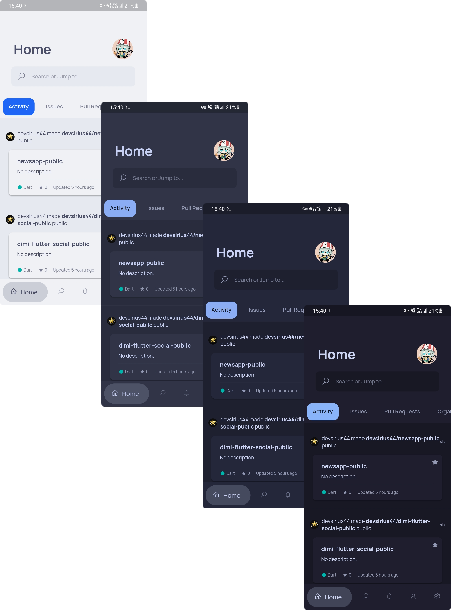
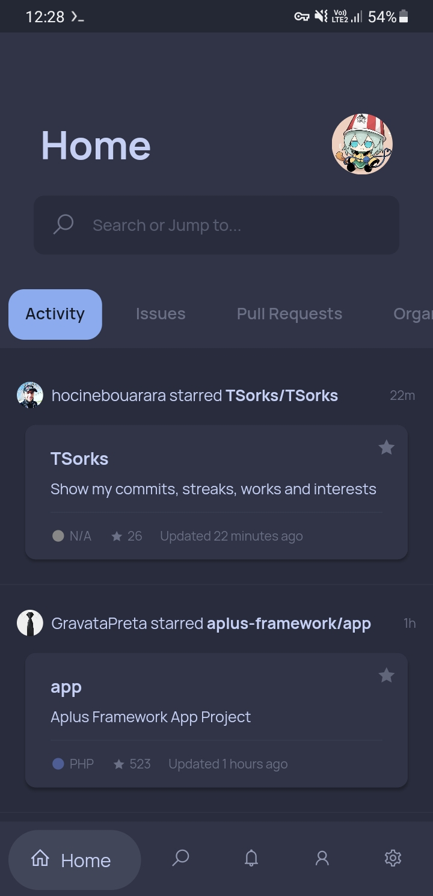
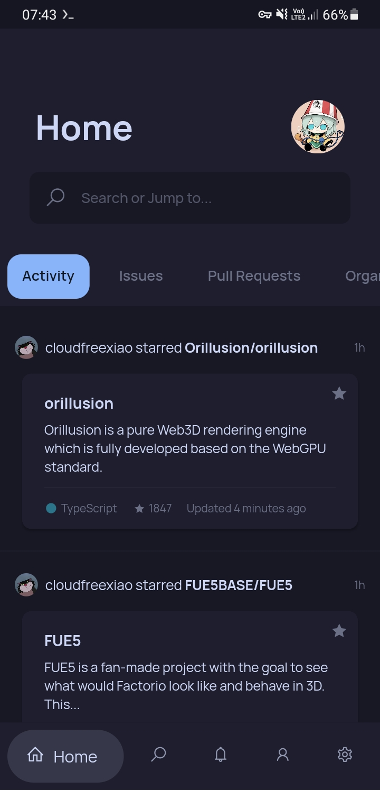

<h3 align="center">
	 
	
	Catppuccin for <a href="https://github.com/NamanShergill/diohub">DioHub</a>
	
</h3>

	
	
	

	

## Previews

🌻 Latte

🪴 Frappé

🌺 Macchiato

🌿 Mocha

## Usage

1. Ensure [DioHub](https://github.com/NamanShergill/diohub) is installed.
2. Open the link below:

🌻 Latte

<li> <strong><a href="https://theme.felix.diohub?format_ver=0&faded2=ff8c8fa1&red=ffd20f39&secondary=ffdce0e8&faded1=ff9ca0b0&elementsOnColors=ff5c5f77&green=ff40a02b&baseElements=ff6c6f85&accent=ffdc8a78&primary=ffeff1f5&faded3=ff7c7f93">&nbsp;Rosewater</a></strong></li>
<li> <strong><a href="https://theme.felix.diohub?format_ver=0&faded2=ff8c8fa1&red=ffd20f39&secondary=ffdce0e8&faded1=ff9ca0b0&elementsOnColors=ff5c5f77&green=ff40a02b&baseElements=ff6c6f85&accent=ffdd7878&primary=ffeff1f5&faded3=ff7c7f93">&nbsp;Flamingo</a></strong></li>
<li> <strong><a href="https://theme.felix.diohub?format_ver=0&faded2=ff8c8fa1&red=ffd20f39&secondary=ffdce0e8&faded1=ff9ca0b0&elementsOnColors=ff5c5f77&green=ff40a02b&baseElements=ff6c6f85&accent=ffea76cb&primary=ffeff1f5&faded3=ff7c7f93">&nbsp;Pink</a></strong></li>
<li> <strong><a href="https://theme.felix.diohub?format_ver=0&faded2=ff8c8fa1&red=ffd20f39&secondary=ffdce0e8&faded1=ff9ca0b0&elementsOnColors=ff5c5f77&green=ff40a02b&baseElements=ff6c6f85&accent=ff8839ef&primary=ffeff1f5&faded3=ff7c7f93">&nbsp;Mauve</a></strong></li>
<li> <strong><a href="https://theme.felix.diohub?format_ver=0&faded2=ff8c8fa1&red=ffd20f39&secondary=ffdce0e8&faded1=ff9ca0b0&elementsOnColors=ff5c5f77&green=ff40a02b&baseElements=ff6c6f85&accent=ffd20f39&primary=ffeff1f5&faded3=ff7c7f93">&nbsp;Red</a></strong></li>
<li> <strong><a href="https://theme.felix.diohub?format_ver=0&faded2=ff8c8fa1&red=ffd20f39&secondary=ffdce0e8&faded1=ff9ca0b0&elementsOnColors=ff5c5f77&green=ff40a02b&baseElements=ff6c6f85&accent=ffe64553&primary=ffeff1f5&faded3=ff7c7f93">&nbsp;Maroon</a></strong></li>
<li> <strong><a href="https://theme.felix.diohub?format_ver=0&faded2=ff8c8fa1&red=ffd20f39&secondary=ffdce0e8&faded1=ff9ca0b0&elementsOnColors=ff5c5f77&green=ff40a02b&baseElements=ff6c6f85&accent=fffe640b&primary=ffeff1f5&faded3=ff7c7f93">&nbsp;Peach</a></strong></li>
<li> <strong><a href="https://theme.felix.diohub?format_ver=0&faded2=ff8c8fa1&red=ffd20f39&secondary=ffdce0e8&faded1=ff9ca0b0&elementsOnColors=ff5c5f77&green=ff40a02b&baseElements=ff6c6f85&accent=ffdf8e1d&primary=ffeff1f5&faded3=ff7c7f93">&nbsp;Yellow</a></strong></li>
<li> <strong><a href="https://theme.felix.diohub?format_ver=0&faded2=ff8c8fa1&red=ffd20f39&secondary=ffdce0e8&faded1=ff9ca0b0&elementsOnColors=ff5c5f77&green=ff40a02b&baseElements=ff6c6f85&accent=ff40a02b&primary=ffeff1f5&faded3=ff7c7f93">&nbsp;Green</a></strong></li>
<li> <strong><a href="https://theme.felix.diohub?format_ver=0&faded2=ff8c8fa1&red=ffd20f39&secondary=ffdce0e8&faded1=ff9ca0b0&elementsOnColors=ff5c5f77&green=ff40a02b&baseElements=ff6c6f85&accent=ff179299&primary=ffeff1f5&faded3=ff7c7f93">&nbsp;Teal</a></strong></li>
<li> <strong><a href="https://theme.felix.diohub?format_ver=0&faded2=ff8c8fa1&red=ffd20f39&secondary=ffdce0e8&faded1=ff9ca0b0&elementsOnColors=ff5c5f77&green=ff40a02b&baseElements=ff6c6f85&accent=ff04a5e5&primary=ffeff1f5&faded3=ff7c7f93">&nbsp;Sky</a></strong></li>
<li> <strong><a href="https://theme.felix.diohub?format_ver=0&faded2=ff8c8fa1&red=ffd20f39&secondary=ffdce0e8&faded1=ff9ca0b0&elementsOnColors=ff5c5f77&green=ff40a02b&baseElements=ff6c6f85&accent=ff209fb5&primary=ffeff1f5&faded3=ff7c7f93">&nbsp;Sapphire</a></strong></li>
<li> <strong><a href="https://theme.felix.diohub?format_ver=0&faded2=ff8c8fa1&red=ffd20f39&secondary=ffdce0e8&faded1=ff9ca0b0&elementsOnColors=ff5c5f77&green=ff40a02b&baseElements=ff6c6f85&accent=ff1e66f5&primary=ffeff1f5&faded3=ff7c7f93">&nbsp;Blue</a></strong></li>
<li> <strong><a href="https://theme.felix.diohub?format_ver=0&faded2=ff8c8fa1&red=ffd20f39&secondary=ffdce0e8&faded1=ff9ca0b0&elementsOnColors=ff5c5f77&green=ff40a02b&baseElements=ff6c6f85&accent=ff7287fd&primary=ffeff1f5&faded3=ff7c7f93">&nbsp;Lavender</a></strong></li>

🪴 Frappé

<li> <strong><a href="https://theme.felix.diohub?format_ver=0&faded2=ff838ba7&red=ffe78284&secondary=ff232634&faded1=ff737994&elementsOnColors=ffb5bfe2&green=ffa6d189&baseElements=ffa5adce&accent=fff2d5cf&primary=ff303446&faded3=ff949cbb">&nbsp;Rosewater</a></strong></li>
<li> <strong><a href="https://theme.felix.diohub?format_ver=0&faded2=ff838ba7&red=ffe78284&secondary=ff232634&faded1=ff737994&elementsOnColors=ffb5bfe2&green=ffa6d189&baseElements=ffa5adce&accent=ffeebebe&primary=ff303446&faded3=ff949cbb">&nbsp;Flamingo</a></strong></li>
<li> <strong><a href="https://theme.felix.diohub?format_ver=0&faded2=ff838ba7&red=ffe78284&secondary=ff232634&faded1=ff737994&elementsOnColors=ffb5bfe2&green=ffa6d189&baseElements=ffa5adce&accent=fff4b8e4&primary=ff303446&faded3=ff949cbb">&nbsp;Pink</a></strong></li>
<li> <strong><a href="https://theme.felix.diohub?format_ver=0&faded2=ff838ba7&red=ffe78284&secondary=ff232634&faded1=ff737994&elementsOnColors=ffb5bfe2&green=ffa6d189&baseElements=ffa5adce&accent=ffca9ee6&primary=ff303446&faded3=ff949cbb">&nbsp;Mauve</a></strong></li>
<li> <strong><a href="https://theme.felix.diohub?format_ver=0&faded2=ff838ba7&red=ffe78284&secondary=ff232634&faded1=ff737994&elementsOnColors=ffb5bfe2&green=ffa6d189&baseElements=ffa5adce&accent=ffe78284&primary=ff303446&faded3=ff949cbb">&nbsp;Red</a></strong></li>
<li> <strong><a href="https://theme.felix.diohub?format_ver=0&faded2=ff838ba7&red=ffe78284&secondary=ff232634&faded1=ff737994&elementsOnColors=ffb5bfe2&green=ffa6d189&baseElements=ffa5adce&accent=ffea999c&primary=ff303446&faded3=ff949cbb">&nbsp;Maroon</a></strong></li>
<li> <strong><a href="https://theme.felix.diohub?format_ver=0&faded2=ff838ba7&red=ffe78284&secondary=ff232634&faded1=ff737994&elementsOnColors=ffb5bfe2&green=ffa6d189&baseElements=ffa5adce&accent=ffef9f76&primary=ff303446&faded3=ff949cbb">&nbsp;Peach</a></strong></li>
<li> <strong><a href="https://theme.felix.diohub?format_ver=0&faded2=ff838ba7&red=ffe78284&secondary=ff232634&faded1=ff737994&elementsOnColors=ffb5bfe2&green=ffa6d189&baseElements=ffa5adce&accent=ffe5c890&primary=ff303446&faded3=ff949cbb">&nbsp;Yellow</a></strong></li>
<li> <strong><a href="https://theme.felix.diohub?format_ver=0&faded2=ff838ba7&red=ffe78284&secondary=ff232634&faded1=ff737994&elementsOnColors=ffb5bfe2&green=ffa6d189&baseElements=ffa5adce&accent=ffa6d189&primary=ff303446&faded3=ff949cbb">&nbsp;Green</a></strong></li>
<li> <strong><a href="https://theme.felix.diohub?format_ver=0&faded2=ff838ba7&red=ffe78284&secondary=ff232634&faded1=ff737994&elementsOnColors=ffb5bfe2&green=ffa6d189&baseElements=ffa5adce&accent=ff81c8be&primary=ff303446&faded3=ff949cbb">&nbsp;Teal</a></strong></li>
<li> <strong><a href="https://theme.felix.diohub?format_ver=0&faded2=ff838ba7&red=ffe78284&secondary=ff232634&faded1=ff737994&elementsOnColors=ffb5bfe2&green=ffa6d189&baseElements=ffa5adce&accent=ff99d1db&primary=ff303446&faded3=ff949cbb">&nbsp;Sky</a></strong></li>
<li> <strong><a href="https://theme.felix.diohub?format_ver=0&faded2=ff838ba7&red=ffe78284&secondary=ff232634&faded1=ff737994&elementsOnColors=ffb5bfe2&green=ffa6d189&baseElements=ffa5adce&accent=ff85c1dc&primary=ff303446&faded3=ff949cbb">&nbsp;Sapphire</a></strong></li>
<li> <strong><a href="https://theme.felix.diohub?format_ver=0&faded2=ff838ba7&red=ffe78284&secondary=ff232634&faded1=ff737994&elementsOnColors=ffb5bfe2&green=ffa6d189&baseElements=ffa5adce&accent=ff8caaee&primary=ff303446&faded3=ff949cbb">&nbsp;Blue</a></strong></li>
<li> <strong><a href="https://theme.felix.diohub?format_ver=0&faded2=ff838ba7&red=ffe78284&secondary=ff232634&faded1=ff737994&elementsOnColors=ffb5bfe2&green=ffa6d189&baseElements=ffa5adce&accent=ffbabbf1&primary=ff303446&faded3=ff949cbb">&nbsp;Lavender</a></strong></li>

🌺 Macchiato

<li> <strong><a href="https://theme.felix.diohub?format_ver=0&faded2=ff8087a2&red=ffed8796&secondary=ff181926&faded1=ff6e738d&elementsOnColors=ffb8c0e0&green=ffa6da95&baseElements=ffa5adcb&accent=fff4dbd6&primary=ff24273a&faded3=ff939ab7">&nbsp;Rosewater</a></strong></li>
<li> <strong><a href="https://theme.felix.diohub?format_ver=0&faded2=ff8087a2&red=ffed8796&secondary=ff181926&faded1=ff6e738d&elementsOnColors=ffb8c0e0&green=ffa6da95&baseElements=ffa5adcb&accent=fff0c6c6&primary=ff24273a&faded3=ff939ab7">&nbsp;Flamingo</a></strong></li>
<li> <strong><a href="https://theme.felix.diohub?format_ver=0&faded2=ff8087a2&red=ffed8796&secondary=ff181926&faded1=ff6e738d&elementsOnColors=ffb8c0e0&green=ffa6da95&baseElements=ffa5adcb&accent=fff5bde6&primary=ff24273a&faded3=ff939ab7">&nbsp;Pink</a></strong></li>
<li> <strong><a href="https://theme.felix.diohub?format_ver=0&faded2=ff8087a2&red=ffed8796&secondary=ff181926&faded1=ff6e738d&elementsOnColors=ffb8c0e0&green=ffa6da95&baseElements=ffa5adcb&accent=ffc6a0f6&primary=ff24273a&faded3=ff939ab7">&nbsp;Mauve</a></strong></li>
<li> <strong><a href="https://theme.felix.diohub?format_ver=0&faded2=ff8087a2&red=ffed8796&secondary=ff181926&faded1=ff6e738d&elementsOnColors=ffb8c0e0&green=ffa6da95&baseElements=ffa5adcb&accent=ffed8796&primary=ff24273a&faded3=ff939ab7">&nbsp;Red</a></strong></li>
<li> <strong><a href="https://theme.felix.diohub?format_ver=0&faded2=ff8087a2&red=ffed8796&secondary=ff181926&faded1=ff6e738d&elementsOnColors=ffb8c0e0&green=ffa6da95&baseElements=ffa5adcb&accent=ffee99a0&primary=ff24273a&faded3=ff939ab7">&nbsp;Maroon</a></strong></li>
<li> <strong><a href="https://theme.felix.diohub?format_ver=0&faded2=ff8087a2&red=ffed8796&secondary=ff181926&faded1=ff6e738d&elementsOnColors=ffb8c0e0&green=ffa6da95&baseElements=ffa5adcb&accent=fff5a97f&primary=ff24273a&faded3=ff939ab7">&nbsp;Peach</a></strong></li>
<li> <strong><a href="https://theme.felix.diohub?format_ver=0&faded2=ff8087a2&red=ffed8796&secondary=ff181926&faded1=ff6e738d&elementsOnColors=ffb8c0e0&green=ffa6da95&baseElements=ffa5adcb&accent=ffeed49f&primary=ff24273a&faded3=ff939ab7">&nbsp;Yellow</a></strong></li>
<li> <strong><a href="https://theme.felix.diohub?format_ver=0&faded2=ff8087a2&red=ffed8796&secondary=ff181926&faded1=ff6e738d&elementsOnColors=ffb8c0e0&green=ffa6da95&baseElements=ffa5adcb&accent=ffa6da95&primary=ff24273a&faded3=ff939ab7">&nbsp;Green</a></strong></li>
<li> <strong><a href="https://theme.felix.diohub?format_ver=0&faded2=ff8087a2&red=ffed8796&secondary=ff181926&faded1=ff6e738d&elementsOnColors=ffb8c0e0&green=ffa6da95&baseElements=ffa5adcb&accent=ff8bd5ca&primary=ff24273a&faded3=ff939ab7">&nbsp;Teal</a></strong></li>
<li> <strong><a href="https://theme.felix.diohub?format_ver=0&faded2=ff8087a2&red=ffed8796&secondary=ff181926&faded1=ff6e738d&elementsOnColors=ffb8c0e0&green=ffa6da95&baseElements=ffa5adcb&accent=ff91d7e3&primary=ff24273a&faded3=ff939ab7">&nbsp;Sky</a></strong></li>
<li> <strong><a href="https://theme.felix.diohub?format_ver=0&faded2=ff8087a2&red=ffed8796&secondary=ff181926&faded1=ff6e738d&elementsOnColors=ffb8c0e0&green=ffa6da95&baseElements=ffa5adcb&accent=ff7dc4e4&primary=ff24273a&faded3=ff939ab7">&nbsp;Sapphire</a></strong></li>
<li> <strong><a href="https://theme.felix.diohub?format_ver=0&faded2=ff8087a2&red=ffed8796&secondary=ff181926&faded1=ff6e738d&elementsOnColors=ffb8c0e0&green=ffa6da95&baseElements=ffa5adcb&accent=ff8aadf4&primary=ff24273a&faded3=ff939ab7">&nbsp;Blue</a></strong></li>
<li> <strong><a href="https://theme.felix.diohub?format_ver=0&faded2=ff8087a2&red=ffed8796&secondary=ff181926&faded1=ff6e738d&elementsOnColors=ffb8c0e0&green=ffa6da95&baseElements=ffa5adcb&accent=ffb7bdf8&primary=ff24273a&faded3=ff939ab7">&nbsp;Lavender</a></strong></li>

🌿 Mocha

<li> <strong><a href="https://theme.felix.diohub?format_ver=0&faded2=ff7f849c&red=fff38ba8&secondary=ff11111b&faded1=ff6c7086&elementsOnColors=ffbac2de&green=ffa6e3a1&baseElements=ffa6adc8&accent=fff5e0dc&primary=ff1e1e2e&faded3=ff9399b2">&nbsp;Rosewater</a></strong></li>
<li> <strong><a href="https://theme.felix.diohub?format_ver=0&faded2=ff7f849c&red=fff38ba8&secondary=ff11111b&faded1=ff6c7086&elementsOnColors=ffbac2de&green=ffa6e3a1&baseElements=ffa6adc8&accent=fff2cdcd&primary=ff1e1e2e&faded3=ff9399b2">&nbsp;Flamingo</a></strong></li>
<li> <strong><a href="https://theme.felix.diohub?format_ver=0&faded2=ff7f849c&red=fff38ba8&secondary=ff11111b&faded1=ff6c7086&elementsOnColors=ffbac2de&green=ffa6e3a1&baseElements=ffa6adc8&accent=fff5c2e7&primary=ff1e1e2e&faded3=ff9399b2">&nbsp;Pink</a></strong></li>
<li> <strong><a href="https://theme.felix.diohub?format_ver=0&faded2=ff7f849c&red=fff38ba8&secondary=ff11111b&faded1=ff6c7086&elementsOnColors=ffbac2de&green=ffa6e3a1&baseElements=ffa6adc8&accent=ffcba6f7&primary=ff1e1e2e&faded3=ff9399b2">&nbsp;Mauve</a></strong></li>
<li> <strong><a href="https://theme.felix.diohub?format_ver=0&faded2=ff7f849c&red=fff38ba8&secondary=ff11111b&faded1=ff6c7086&elementsOnColors=ffbac2de&green=ffa6e3a1&baseElements=ffa6adc8&accent=fff38ba8&primary=ff1e1e2e&faded3=ff9399b2">&nbsp;Red</a></strong></li>
<li> <strong><a href="https://theme.felix.diohub?format_ver=0&faded2=ff7f849c&red=fff38ba8&secondary=ff11111b&faded1=ff6c7086&elementsOnColors=ffbac2de&green=ffa6e3a1&baseElements=ffa6adc8&accent=ffeba0ac&primary=ff1e1e2e&faded3=ff9399b2">&nbsp;Maroon</a></strong></li>
<li> <strong><a href="https://theme.felix.diohub?format_ver=0&faded2=ff7f849c&red=fff38ba8&secondary=ff11111b&faded1=ff6c7086&elementsOnColors=ffbac2de&green=ffa6e3a1&baseElements=ffa6adc8&accent=fffab387&primary=ff1e1e2e&faded3=ff9399b2">&nbsp;Peach</a></strong></li>
<li> <strong><a href="https://theme.felix.diohub?format_ver=0&faded2=ff7f849c&red=fff38ba8&secondary=ff11111b&faded1=ff6c7086&elementsOnColors=ffbac2de&green=ffa6e3a1&baseElements=ffa6adc8&accent=fff9e2af&primary=ff1e1e2e&faded3=ff9399b2">&nbsp;Yellow</a></strong></li>
<li> <strong><a href="https://theme.felix.diohub?format_ver=0&faded2=ff7f849c&red=fff38ba8&secondary=ff11111b&faded1=ff6c7086&elementsOnColors=ffbac2de&green=ffa6e3a1&baseElements=ffa6adc8&accent=ffa6e3a1&primary=ff1e1e2e&faded3=ff9399b2">&nbsp;Green</a></strong></li>
<li> <strong><a href="https://theme.felix.diohub?format_ver=0&faded2=ff7f849c&red=fff38ba8&secondary=ff11111b&faded1=ff6c7086&elementsOnColors=ffbac2de&green=ffa6e3a1&baseElements=ffa6adc8&accent=ff94e2d5&primary=ff1e1e2e&faded3=ff9399b2">&nbsp;Teal</a></strong></li>
<li> <strong><a href="https://theme.felix.diohub?format_ver=0&faded2=ff7f849c&red=fff38ba8&secondary=ff11111b&faded1=ff6c7086&elementsOnColors=ffbac2de&green=ffa6e3a1&baseElements=ffa6adc8&accent=ff89dceb&primary=ff1e1e2e&faded3=ff9399b2">&nbsp;Sky</a></strong></li>
<li> <strong><a href="https://theme.felix.diohub?format_ver=0&faded2=ff7f849c&red=fff38ba8&secondary=ff11111b&faded1=ff6c7086&elementsOnColors=ffbac2de&green=ffa6e3a1&baseElements=ffa6adc8&accent=ff74c7ec&primary=ff1e1e2e&faded3=ff9399b2">&nbsp;Sapphire</a></strong></li>
<li> <strong><a href="https://theme.felix.diohub?format_ver=0&faded2=ff7f849c&red=fff38ba8&secondary=ff11111b&faded1=ff6c7086&elementsOnColors=ffbac2de&green=ffa6e3a1&baseElements=ffa6adc8&accent=ff89b4fa&primary=ff1e1e2e&faded3=ff9399b2">&nbsp;Blue</a></strong></li>
<li> <strong><a href="https://theme.felix.diohub?format_ver=0&faded2=ff7f849c&red=fff38ba8&secondary=ff11111b&faded1=ff6c7086&elementsOnColors=ffbac2de&green=ffa6e3a1&baseElements=ffa6adc8&accent=ffb4befe&primary=ff1e1e2e&faded3=ff9399b2">&nbsp;Lavender</a></strong></li>

3. If it prompts you to select an app, choose DioHub. 
4. Once you're in DioHub, it'll prompt you to load the theme or not. Select "Confirm".

## 🙋 FAQ

- Q: **_The link doesn't prompt you to select an app, how to fix it?_**\
  A: Browsers doesn't automatically open the link to an app, instead it'll provide you an option to "Open in App". For Firefox Mobile, once you opened the link, tap the double dots on the right bottom screen, scroll until you find "Open in App" and select it.

## 💝 Thanks to

- [Komo](https://github.com/cattokomo)

&nbsp;

	

	Copyright &copy; 2021-present <a href="https://github.com/catppuccin" target="_blank">Catppuccin Org</a>

	

